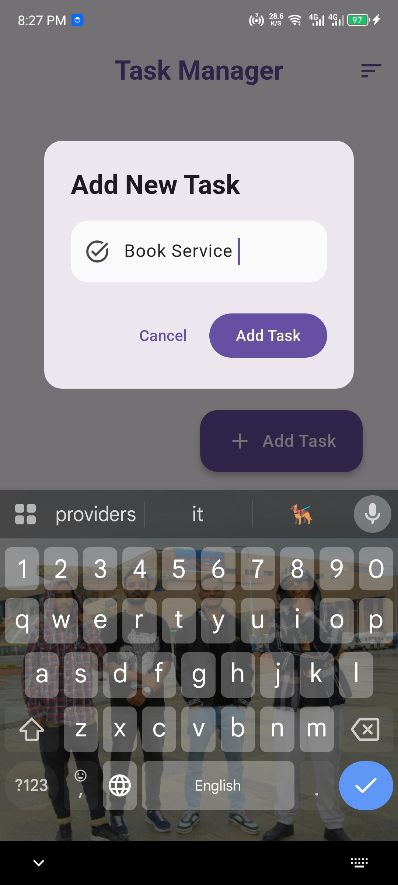
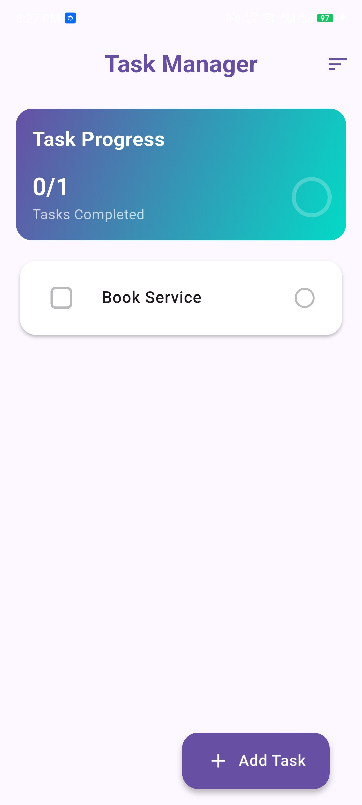
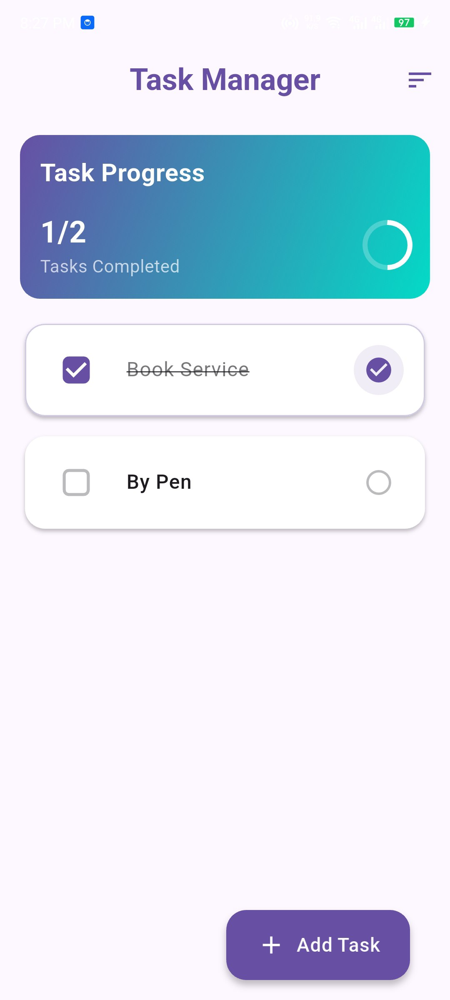

# Task Manager App

A simple and intuitive task management application built with Flutter.

## Features
- Add, complete, and delete tasks
- Persistent storage using SharedPreferences
- Clean Material Design 3 UI
- Swipe to delete functionality
- Beautiful task progress tracking
- Modern gradient design

## Screenshots

### Main Screen

### Adding a Task

### Task List

### Task Progress

### Task Completion

### Task Deletion

### Empty State

## Dependencies
- Flutter SDK
- shared_preferences: ^2.2.2
- provider: ^6.1.1