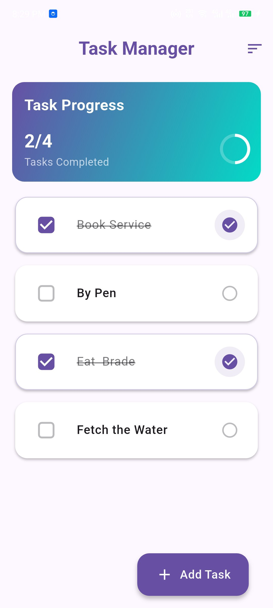
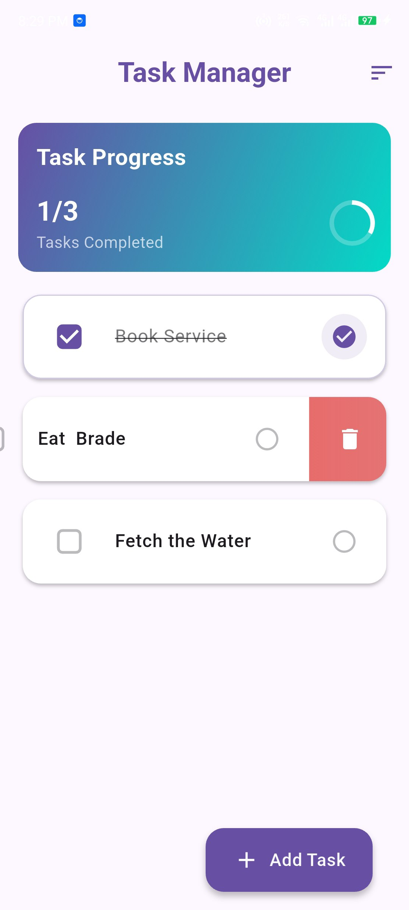
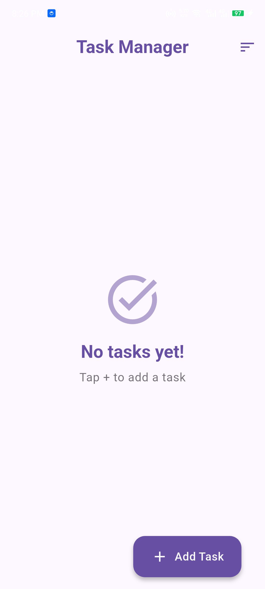

# 📝 Task Manager App

[](https://opensource.org/licenses/MIT) [](CONTRIBUTING.md) [](https://flutter.dev)

A simple yet powerful task management application built with Flutter, designed with a clean and modern user interface. Stay organized and track your progress with a beautiful gradient design and intuitive controls.

## ✨ Key Features

- ✅ **Full CRUD Functionality:** Add, complete, and delete tasks with ease.
- 📲 **Intuitive Gestures:** Swipe to delete tasks instantly.
- 🎨 **Modern UI:** Built with Material Design 3 for a clean, contemporary look.
- 💾 **Persistent Storage:** Your tasks are saved locally using `shared_preferences`.
- 📊 **Progress Tracking:** A beautiful circular progress indicator shows your completion rate.
- 🌈 **Gradient Design:** Visually appealing gradients throughout the app.

## 📸 App Preview

| Main View & Progress | Adding a Task |
| :---: | :---: |
|  |  |
| **Task List** (2 completed, 1 pending) | **Clean Add Task Dialog** |

| Swipe to Delete | Empty State |
| :---: | :---: |
|  |  |
| **Intuitive Swipe Gesture** | **Clean UI for New Users** |


## 🛠️ Tech Stack & Dependencies

- **Framework:** [Flutter](https://flutter.dev/)
- **Language:** [Dart](https://dart.dev/)
- **State Management:** [Provider](https://pub.dev/packages/provider)
- **Local Storage:** [SharedPreferences](https://pub.dev/packages/shared_preferences)

## 🚀 Getting Started

Follow these instructions to get a copy of the project up and running on your local machine for development and testing.

### Prerequisites

You need to have the Flutter SDK installed on your machine. You can find installation instructions [here](https://flutter.dev/docs/get-started/install).

### Installation & Running

1. **Clone the repository:**
   ```sh
   git clone https://github.com/kusalechisa/kurazinterntest.git